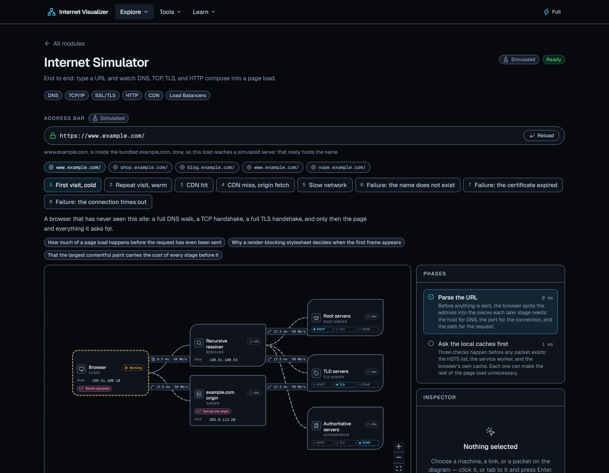
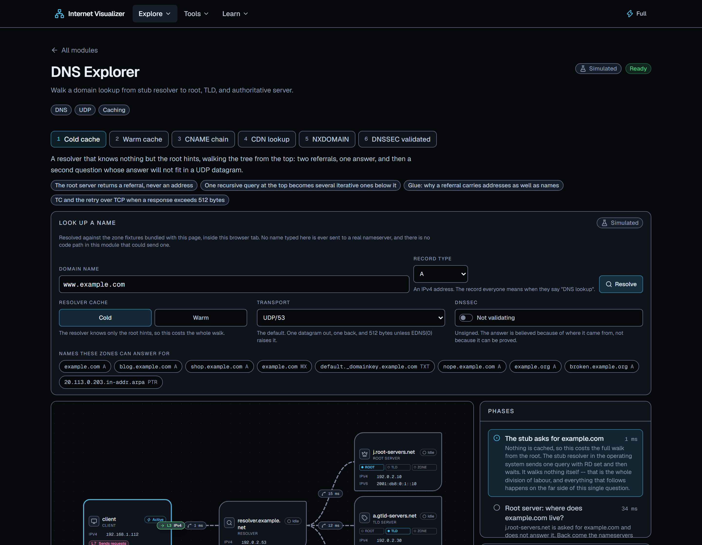
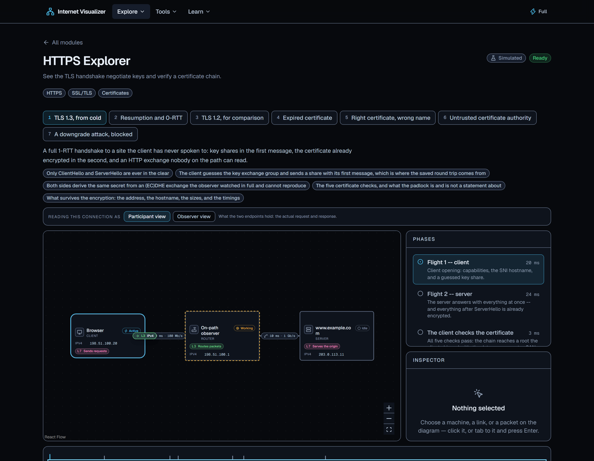
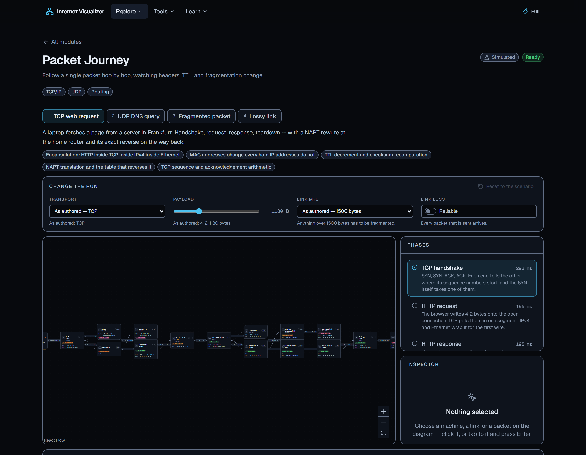

# Internet Visualizer

**How the Internet actually works, animated — DNS, TCP, TLS, HTTP and the rest, as
simulations you can step through rather than paragraphs you have to picture.**

Ten modules, thirty-three lessons, and one rule: every claim on screen is either something
you can watch happen or something with an RFC section number next to it.

> **Everything here is a deterministic client-side simulation, except Network
> Diagnostics' Live mode** — which is off until you turn it on, tells you the exact URL it
> is about to request before it requests it, and wears a different badge the whole time it
> is running. Nothing else in this product can reach a network, and
> [`tests/registry.test.ts`](tests/registry.test.ts) fails the build if a second module
> ever tries.



## What is in it

Each name below links to that module's source; the routes are `/network-map`,
`/dns-explorer` and so on when the app is running.

### Explore — one protocol, taken apart

| Module                                | What you watch                                                                             |
| ------------------------------------- | ------------------------------------------------------------------------------------------ |
| [Network Map](src/modules/network-map)           | A network built up machine by machine, from one house to a datacenter                       |
| [Packet Journey](src/modules/packet-journey)     | A single packet hop by hop — headers, TTL, NAT, fragmentation, all changing as it goes      |
| [DNS Explorer](src/modules/dns-explorer)         | A name becoming an address: stub → resolver → root → TLD → authoritative, with the cache visible |
| [HTTP Explorer](src/modules/http-explorer)       | A request and response header by header, plus cookies, caching and the version differences  |
| [HTTPS Explorer](src/modules/https-explorer)     | The TLS handshake negotiating keys and verifying a certificate chain                        |
| [API Visualizer](src/modules/api-visualizer)     | REST calls, status codes, OAuth, PKCE, JWTs, rate limits, and the ways they go wrong        |
| [WebSocket Viewer](src/modules/websocket-viewer) | An HTTP connection upgrading, then carrying frames both ways                                |
| [Internet Simulator](src/modules/internet-simulator) | All of it at once: type a URL, watch DNS, TCP, TLS and HTTP compose into a page load     |

### Tools

| Module                                        | What it does                                                          |
| --------------------------------------------- | --------------------------------------------------------------------- |
| [Network Diagnostics](src/modules/network-diagnostics)   | ping, traceroute, DNS lookup and WHOIS — simulated, with an opt-in live mode |

### Learn

| Module                            | What it is                                                                    |
| --------------------------------- | ------------------------------------------------------------------------------ |
| [Learning Center](src/modules/learning-center)         | 33 lessons across 7 tracks, plus a 63-term glossary. Every lesson embeds a module's own run, so a lesson cannot contradict the thing it teaches |



## Three things that are unusual about it

**1. A lesson embeds the module's simulation, not a recording of it.** `<EmbeddedSim
module="dns-explorer" scenario="cold-cache" />` resolves through a shared manifest and
plays the same run the module's own scenario picker plays, quoting the same summary. There
is no animation code anywhere in the Learning Center and there must never be any — the
moment a lesson draws its own packet, the lesson can be wrong about one.

**2. Every claim is cited, and the citations are tested.** A teaching annotation carries an
`RfcRef` alongside the sentence it justifies, and the inspector renders it. Running every
scenario produces 503 citations naming 45 RFCs; `tests/rfc-references.test.ts` fails if one
is malformed or names a document [`docs/ACCURACY.md`](docs/ACCURACY.md) does not list. That
file is also where every deliberate simplification is written down — including the largest
one, which is that there is no cryptography anywhere in the TLS layer.

**3. Every scenario is deterministic, and that is enforced.** `tests/determinism.test.ts`
runs every scenario in the codebase twice and asserts the two runs are deep-equal. One
`Math.random()` or one `Date.now()` under a `sim/` folder would break scrubbing backwards,
break lessons, and pass every other test in the suite.



## Running it

```bash
npm install
npm run dev            # http://localhost:3000
```

Everything else:

```bash
npm run build          # production build
npm start              # serve it

npm run lint           # ESLint, including the architecture boundary rules
npm run typecheck      # tsc --noEmit  (needs a build first — see below)
npm run format:check   # Prettier

npm test               # Vitest, single run
npm run test:coverage  # ...with the coverage thresholds enforced
npm run test:e2e       # Playwright, against a production build on :3100
```

`npm run typecheck` needs `npm run build` to have run at least once: Next 16 generates the
global route types into `.next/types`, and `tsc` cannot resolve them before then. CI builds
before typechecking for that reason.

Nothing needs configuring. There is no database, no account, no secret and no required
environment variable — Live mode's three lookups go to public, unauthenticated endpoints
that are constants in the code rather than settings. [`.env.example`](.env.example)
documents the two optional variables that do exist (the canonical site URL and the CSP
mode), and, more usefully, which things are deliberately *not* configurable and why.

**Requirements:** Node 22+. Built on Next 16.3, React 19.2, Tailwind 4, TypeScript 5.



## How it is put together

```
src/
  app/          # Next.js App Router routes (+ the three diagnostics Route Handlers)
  core/         # framework-free simulation and networking logic
    protocols/  #   ipv4, udp, tcp, dns, tls, http — shared by every module
    sim/        #   the event model and the projection playback reads
    net/        #   the SSRF guard, the rate limiter, the diagnostics contract
  components/   # reusable UI and visualization primitives
    viz/        #   SimulationView: canvas, timeline, inspector, event log, keyboard map
  modules/      # one folder per protocol module, plus registry.ts and scenarios.ts
tests/          # the cross-cutting tests: determinism, contrast, RFC citations, registry
e2e/            # Playwright: smoke, per-module, axe, and the manual-a11y checklist
```

**A simulation does not draw anything.** It runs a protocol script on a virtual clock and
emits a sorted list of `SimEvent`s; the visualization layer reads that list and decides
what to animate. That one-way boundary is why protocol behaviour is unit-testable with no
DOM, and why one `SimulationView` drives all nine simulating modules — building a module
means writing a scenario, not writing animation code.

**Three boundaries are enforced by lint rather than by convention**, in
[`eslint.config.mjs`](eslint.config.mjs):

1. `src/core/**` may not import React, Next, React Flow, `motion`, `zustand`, or anything
   under `app/`, `components/` or `modules/`.
2. `src/modules/<a>/**` may not import from `src/modules/<b>/**`. Shared logic is promoted
   to `src/core/protocols/`, never copied sideways.
3. `src/components/**` may not import from `src/modules/**`.

Each of those exists because the alternative erodes within a couple of phases. Every folder
in `src/` carries a `README.md` saying what belongs in it and what must never be imported
into it.

## Accessibility

Checked, not assumed. `e2e/a11y.spec.ts` runs axe-core against every route — all ten
modules, the glossary and all thirty-three lessons — and fails on any serious or critical
violation. `e2e/a11y-manual.spec.ts` covers what a static scan cannot see: keyboard
traversal of the timeline, the `aria-live` phase announcements, the focusable list view
that is the non-pointer alternative to each React Flow canvas, and 200% zoom.

Two unit tests hold the underlying properties: `tests/tokens-contrast.test.ts` asserts every
text token clears 4.5:1 and every border 3:1 on every surface, and
`tests/non-colour-signals.test.ts` asserts no two node states, node kinds or link media are
indistinguishable in greyscale. Reduced motion is honoured throughout, and playback
collapses to discrete steps rather than merely animating faster.

## Security posture

The security rules in [`CLAUDE.md`](CLAUDE.md) apply literally to
[`src/app/api/diagnostics/`](src/app/api/diagnostics/README.md), which is the only code in
the product that can reach a network:

- **Three operations, all read-only, all `GET`:** a DoH lookup, an RDAP lookup, and one
  HTTP `HEAD` with timing. There is no fourth, and there is no live traceroute — a
  serverless runtime cannot send ICMP, and faking it would be worse than omitting it.
- **One chokepoint.** Every outbound request goes through `guardedFetch`, behind an SSRF
  guard that resolves the target first and refuses private, reserved, loopback, link-local
  and cloud-metadata addresses. `src/core/net/guard.ts` carries a 95% coverage floor, higher
  than anything else in the codebase.
- **Rate limited**, per client, by a token bucket.
- **Disclosed before it runs.** The panel that shows you the URL and the handler that
  requests it call the same function, so the two cannot differ.
- **Never persisted.** Live mode lives in component state; a reload returns you to Learn
  mode.

Every response also carries a Content-Security-Policy, HSTS, `nosniff`,
`Referrer-Policy: strict-origin-when-cross-origin` and a `Permissions-Policy` that denies
camera, microphone and geolocation. One directive in that policy is worth naming, because
it turns a promise into an enforcement: **`connect-src 'self'`**. It means no page in the
product can reach another origin from the browser at all — a simulated module could not
make a live network call even if its code tried. Live mode still works, because its
lookups are same-origin requests to this deployment and the outbound half happens on the
server, behind the guard above. The policy is in
[`src/lib/securityHeaders.ts`](src/lib/securityHeaders.ts) with the argument for every
directive, including an honest note about the one that is weaker than it should be.

## Documentation

| File                                                    | What it is                                                          |
| ------------------------------------------------------- | -------------------------------------------------------------------- |
| [`docs/ACCURACY.md`](docs/ACCURACY.md)                  | Every protocol claim, mapped to its RFC, plus every simplification    |
| [`docs/CONTENT-STYLE.md`](docs/CONTENT-STYLE.md)        | How to write an annotation, a log line, and a lesson                  |
| [`docs/implementation/`](docs/implementation/00-overview.md) | The build plan, phase by phase — the source of truth for *how* |
| [`CLAUDE.md`](CLAUDE.md)                                | Working notes: commands, invariants, and the things that quietly break |
| [`perf/README.md`](perf/README.md)                      | How to reproduce the performance numbers                              |
| [`e2e/README.md`](e2e/README.md)                        | What belongs in a browser test and what does not                      |

## Licence

Not yet chosen.
